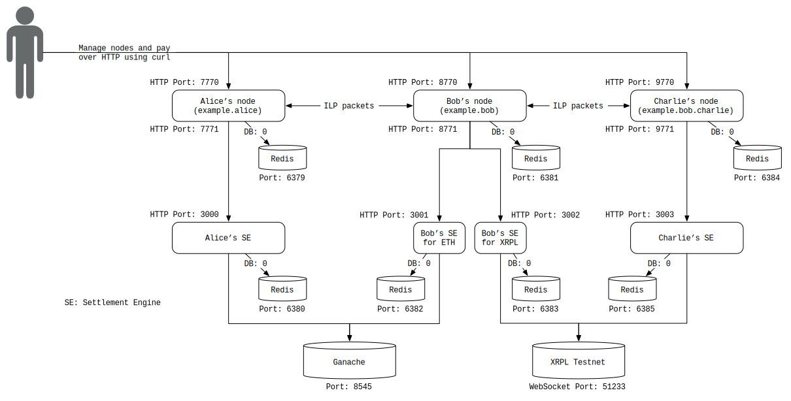

# README

- [x] Basic testnet wallet operation
- [x] Outline the structure of a ILP-enabled web app
- [x] Understand and deploy moneyd and start a local testnet
- [x] Spin up local ILP network (using interledger-rs)
- [x] Try out [Interledger-rs API Specification](https://app.swaggerhub.com/apis/interledger-rs/Interledger/1.1) locally
- [ ] Build a demo web app to submit ILP SPSP Invoice
- [x] Understand and deploy [moneyd](https://github.com/interledgerjs/moneyd) and start a local testnet
- [ ] Enable applications that run on top of Interledger, using [ilp-plugin](https://www.npmjs.com/package/ilp-plugin) NPM package
- [ ] Auxillary: Deploy and run a JavaScript [ILP connector](https://github.com/interledgerjs/ilp-connector)
- [ ] Auxillary: Connect ILP connector to Interledger
- [ ] Auxillary: Connect web app to ILP connector

# Basic testnet wallet operation

There are two ways to generate Interledger account on testnet.

## Method 1: [Sign in to Xpring Testnet Faucet](https://wallet.ilpv4.dev/ilp-wallet)

Once you sign up using Github, you can acquire:

1. Testnet Interledger account on Xpring
2. acuiqre XRP testnet faucet to play with

## Method 2: Make a testnet wallet account using [ILPv4 Testnet Faucet](https://faucet.ilpv4.dev/)

You can use it to generate a testnet wallet operable by REST API, as example below:

| #   | Property       | Value                                           |
| --- | -------------- | ----------------------------------------------- |
| 1   | username       | user_3ejhevq2                                   |
| 2   | ilpOverHttpUrl | https://jc.ilpv4.dev/accounts/user_3ejhevq2/ilp |
| 3   | authToken      | 6SwosVEh0mgEw                                   |
| 4   | paymentPointer | $jc.ilpv4.dev/user_3ejhevq2                     |
| 5   | assetCode      | XRP                                             |
| 6   | assetScale     | 9                                               |

## Check wallet Balance

Using curl to check the balance programmatically

**On RippleX**

```bash
curl --location --request GET 'https://hermes-rest.ilpv4.dev/accounts/user_3ejhevq2/balance' \
--header 'Accept: application/json' \
--header 'Authorization: Bearer 6SwosVEh0mgEw'
```

You will get the response in JSON:

```
{
  "assetCode":"XRP",
  "assetScale":9,
  "accountBalance":{
    "accountId":"user_3ejhevq2",
    "netBalance":0,
    "clearingBalance":0,
    "prepaidAmount":0
  }
}
```

## Send money to another wallet (using payment pointer)

Curl command to send money to `$money.ilpv4.dev/lbzsn7vp` is:

```
curl --location \
--request POST 'https://hermes-rest.ilpv4.dev/accounts/user_3ejhevq2/pay' \
--header 'Content-Type: application/json' \
--header 'Accept: application/json' \
--header 'Authorization: Bearer 6SwosVEh0mgEw' \
--data-raw '{
"amount": "1000000",
"destinationPaymentPointer": "$money.ilpv4.dev/lbzsn7vp"
}'
```

If it is in success, you will see the similar response like this:

```
{"originalAmount":1000000,"amountDelivered":1000000,"amountSent":1000000,"successfulPayment":true}
```

# Outline the structure of a ILP-enabled web app


Sequence diagram from the [rfc](deprecated/0003-interledger-protocol/0003-interledger-protocol.md)

```
  (1,21)                                               (11)
Application                                        Application
       \                                               /
     (2,20)                 (6,16)                 (10,12)
Interledger Module    Interledger Module    Interledger Module
          \               /       \                 /
         (3,19)       (5,17)     (7,15)         (9,13)
          LLI-1       LLI-1       LLI-2         LLI-2
             \  (4,18) /             \  (8,14)   /
            Local Ledger 1          Local Ledger 2
```

In a simplified design,

1. **Sender** and **Receiver** can be the web app to interact with users,
2. **Connector** covers functionality of "Interledger Module", "Local Ledger Interface (LLI)" and intructing "Local Ledger", provides necessary interfaces and service that enable web app to interact with Interledger.

Connectors are responsible to:

1. manage _accounts_ (_account_ and _payment pointer_ are in 1-1 relationship)
2. connect to other _connectors_ of ILP
3. provide a service of forwarding packets and relaying money
4. translating [ILP address](https://github.com/interledger/rfcs/blob/master/0015-ilp-addresses/0015-ilp-addresses.md) (closely related to payment pointer) into interledger routes

## Flows

Details of the Interledger flow is [here](https://github.com/interledger/rfcs/blob/master/0027-interledger-protocol-4/0027-interledger-protocol-4.md#flow) (worth a read)

# Spin up local ILP network

[Follow the step mentioned here](https://interledger.org/developer-tools/get-started/spin-up/), OR

\*\* Run 3 ILP nodes for local test

You can use scripts in scripts folder to deploy testing docker set. Run:

1. ([1_image_pull.sh](scripts/1_image_pull.sh)) to pull images
2. ([2_start_nodes.sh](scripts/2_start_nodes.sh)) to spin up 3 nodes, named Alice, Bob and Charlie

## Testing local ILP network

We simulate Alice sends ETH to Charlie via Bob.

In [script](scripts/1_image_pull.sh) folder,

1. [Check balances](scripts/check_balances.sh)
2. [CLI command](scripts/alice_send_eth_to_charlie.sh) to Alice's node, instruct account Alice to send 200000 gwei to Charlie's account in Charlie's node
3. [Check balances](scripts/check_balances.sh) to see the result

The result ILP network will be like this


## Tear down docker containers

Run [stop_and_remove](scripts/stop_and_remove.sh) to tear down dockers.

# Try out [Interledger-rs API Specification](https://app.swaggerhub.com/apis/interledger-rs/Interledger/1.1) locally

In this example, we published port 7770 of docker container `alice-node`, `bob-node` and `charlie-node` as localhost port `7770`,`8770` and `9770` respectively, we can use HTTP REST API to communicate with these ILP nodes.

You can try out cURL commands in [check_balance_curl.sh](scripts/check_balances_curl.sh)

# Build a demo web app to submit ILP SPSP Invoice

TODO

# Understand and deploy [moneyd](https://github.com/interledgerjs/moneyd) and start a local testnet

Installed `moneyd` and `ilp-plugin`
Default listening port at `7768`.

## Function

- [x] Create Local Test Network
- [ ] Enable applications that run on top of Interledger, using [ilp-plugin](https://www.npmjs.com/package/ilp-plugin) NPM package

(Read through the repo, looks like a dead project, instructions not found yet)

# Deploy and run a ILP connector

The steps to deploy and run JavaScript ILP connector is [here](https://github.com/interledgerjs/ilp-connector)

TODO: Have yet to locate relevant documentation about how to use it to interface a web app with Interledger network. (TBD)

# Resources

[Interledger.js Monorepo](https://github.com/interledgerjs/interledgerjs), which covers STREAMS and payment library
[A demo that sends payments between 3 Interledger.rs nodes and settles using Ethereum transactions and XRP transactions](https://github.com/interledger/interledger-rs/tree/master/examples/eth-xrp-three-nodes)
[Interledger Rust implementation](https://github.com/interledger/interledger-rs)
