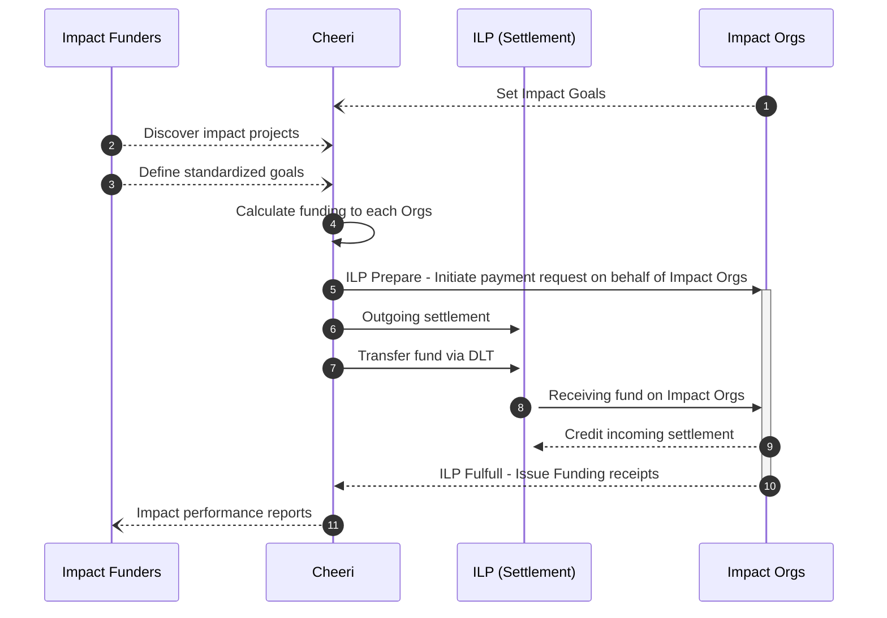

```mermaid
sequenceDiagram
autonumber
participant F as Impact Funders
participant C as Cheeri
participant B as ILP (Settlement)
participant S as Impact Orgs
S--)C: Set Impact Goals
F--)C: Discover impact projects
F--)C: Define standardized goals
C->>C: Calculate funding to each Orgs
C->>+S: ILP Prepare - Initiate payment request on behalf of Impact Orgs
C->>+B: Outgoing settlement
C->>+B: Transfer fund via DLT
B->>S: Receiving fund on Impact Orgs
S-->>B: Credit incoming settlement
S-->>-C: ILP Fulfull - Issue Funding receipts
C--)F: Impact performance reports
```
