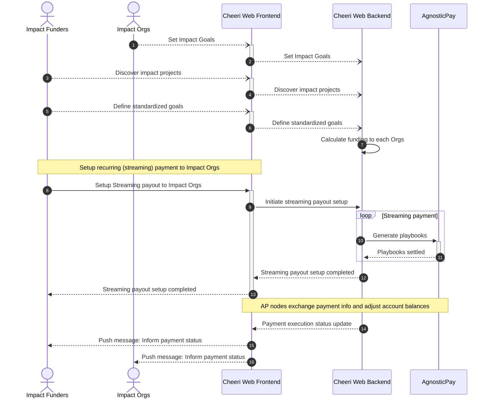

# Cheeri using AgnostiPay (preliminary)

This is the sequence diagram about Cheeri user auto-funding impact organization using AgnostiPay (AP)

```mermaid
sequenceDiagram
autonumber
actor F as Impact Funders
actor I as Impact Orgs
participant ChFE as Cheeri Web Frontend
participant ChBE as Cheeri Web Backend
participant AP as AgnosticPay
I--)+ChFE: Set Impact Goals
ChFE--)-ChBE: Set Impact Goals
F--)+ChFE: Discover impact projects
ChFE--)-ChBE: Discover impact projects
F--)+ChFE: Define standardized goals
ChFE--)-ChBE: Define standardized goals
ChBE->>ChBE: Calculate funding to each Orgs

Note over F,ChFE: Setup recurring (streaming) payment to Impact Orgs
F->>+ChFE: Setup Streaming payout to Impact Orgs
ChFE->>+ChBE: Initiate streaming payout setup

loop Streaming payment
ChBE->>+AP: Generate playbooks
AP-->>-ChBE: Playbooks settled
end

ChBE-->>ChFE: Streaming payout setup completed
ChFE-->>-F: Streaming payout setup completed
Note over AP, ChFE: AP nodes exchange payment info and adjust account balances
ChBE-->>ChFE: Payment execution status update
ChFE-->>F: Push message: Inform payment status
ChFE-->>I: Push message: Inform payment status
```
