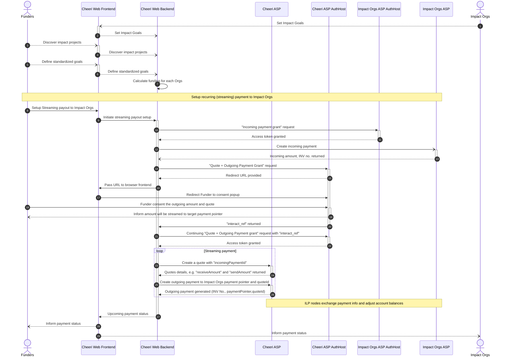

# Cheeri Demo

This is the sequence diagram about funders in Cheeri setup auto-funding to impact organization.

This setup is based on the proposed design of Open Payment using GNAP standard to exchange authorization details.

