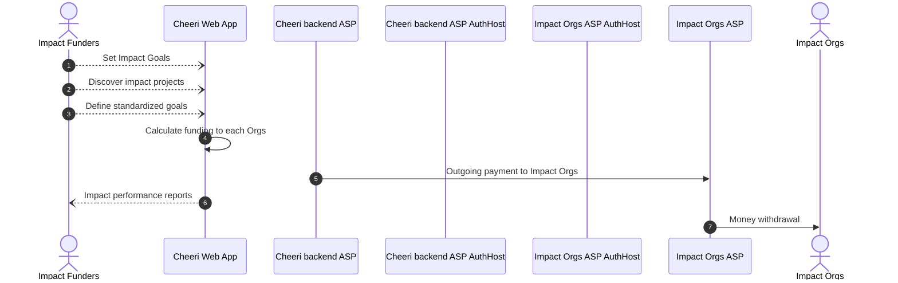

# Cheeri Demo

This is the sequence diagram about Cheeri user auto-funding impact organization.

```mermaid
sequenceDiagram
autonumber
actor F as Impact Funders
participant C as Cheeri Web App
participant CA as Cheeri backend ASP
participant CAAuth as Cheeri backend ASP AuthHost
participant IAA as Impact Orgs ASP AuthHost
participant IA as Impact Orgs ASP
actor I as Impact Orgs
F--)C: Set Impact Goals
F--)C: Discover impact projects
F--)C: Define standardized goals
C->>C: Calculate funding to each Orgs
CA->>IA: Outgoing payment to Impact Orgs
C--)F: Impact performance reports
IA->>I: Money withdrawal
```
