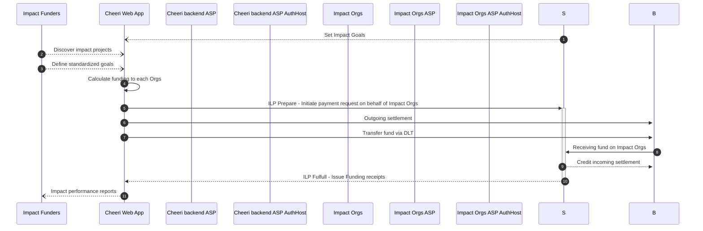

# Cheeri Demo

```mermaid
sequenceDiagram
autonumber
participant F as Impact Funders
participant C as Cheeri Web App
participant CA as Cheeri backend ASP
participant CAAuth as Cheeri backend ASP AuthHost
participant I as Impact Orgs
participant IA as Impact Orgs ASP
participant IAA as Impact Orgs ASP AuthHost
S--)C: Set Impact Goals
F--)C: Discover impact projects
F--)C: Define standardized goals
C->>C: Calculate funding to each Orgs
C->>+S: ILP Prepare - Initiate payment request on behalf of Impact Orgs
C->>+B: Outgoing settlement
C->>+B: Transfer fund via DLT
B->>S: Receiving fund on Impact Orgs
S-->>B: Credit incoming settlement
S-->>-C: ILP Fulfull - Issue Funding receipts
C--)F: Impact performance reports
```
