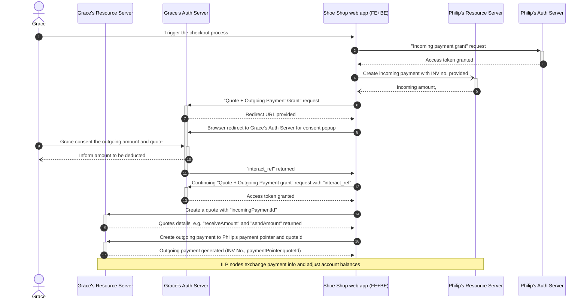

# Divao demo using Rafiki stack

## Pre-requisite

1. Please follow [Rafiki local playground setup](https://github.com/interledger/rafiki/blob/main/infrastructure/local/README.md) to install two ILP node, (a.k.a. account service provider), `cloud-nine-wallet-backend` and `happy-life-bank-backend`, in local environment.
2. Docker, pnpm, node 18 and NVM are required during installation.
3. Install Postman to access [Interledger](https://www.postman.com/interledger/workspace/interledger/collection/22855701-92761441-6d0c-4fc6-aa04-73eccf6afd4c?action=share&creator=1697784) public API collection, and fork it out to run locally.

## System check

You can use following links to see if the testing environment is running properly.

### Checking accounts on account service provider

[Backend account service provider](http://localhost:3030)

1. Grace Franklin https://cloud-nine-wallet-backend/accounts/gfranklin 40.00 USD
2. Bert Hamchest https://cloud-nine-wallet-backend/accounts/bhamchest 40.00 USD
3. World's Best Donut Co https://cloud-nine-wallet-backend/accounts/wbdc 20.00 USD

[Peer backend account service provider](http://localhost:3031)

1. Philip Fry https://happy-life-bank-backend/accounts/pfry 0.01 USD
2. PlanEx Corp https://happy-life-bank-backend/accounts/planex 20.00 USD

## Demo details

### Scenario: Grace buy shoes from Shoe Shop, hence Philip "pull" money from Grace account to his account.



Use the [Postman eCommerce collection](https://www.postman.com/interledger/workspace/interledger/folder/22855701-e27838da-dd72-4b5e-9f1e-086ddfa4d098) to run through below steps.

In this eCommerce Demo, Philip and Grace has accounts on separate **account service provider** (namely `happy-life-bank-backend` and `cloud-nine-wallet-backend`), with payment pointer linked to their accounts.

1. Grace reach Shoe shop Wep app and initiate checkout process (#1)
2. Philip fires a **incoming payment grant request** (#2,#3), to acquire access token necessary to carry out incoming payment
3. Philip fires a **incoming payement** (#4,#5) (a.k.a. generate invoice), to specify the expectation of 33.64USD will come in.
4. Grace fires a **quote and outgoing payment grant request** (#6) to her `cloud-nine-wallet-backend` Resource Server.
   - On the response (#7), the `redirect` URL in the payload is used to instruct front-end to redirect Grace to outgoing payment consent page of `cloud-nine-wallet-backend` Authorization Server (#8).
   - Grace consents (#9,#10) and generate `interactive_ref`, `cloud-nine-wallet-backend` Authorization Server redirect browser back to Shoe Shop web app (#11), and triggers **continuation request** (#12) using the `interactive_ref`, and the access token is acquired (#13)
5. Grace **create a quote** (#14,#15) by the access token acquired
6. Grace create **outgoing payment** (#16,#17) by `quoteId` acquired BEFORE token expire (5, min)

Now, Grace's account is deducted to Philip's account, as shown in [cloud-nine-wallet-backend](http://localhost:3030) and [happy-life-bank-backend](http://localhost:3031)

## Payload examples

### Grant Request Incoming Payment

Request (#2)

```JSON
{
    "access_token": {
        "access": [
            {
                "type": "incoming-payment",
                "actions": [
                    "create", "read", "list", "complete"
                ]
            }
        ]
    },
    "client": "https://happy-life-bank-backend/accounts/pfry",
    "interact": {
        "start": [
            "redirect"
        ],
        "finish": {
            "method": "redirect",
            "uri": "http://localhost:3030/mock-idp/fake-client",
            "nonce": "123"
        }
    }
}
```

Response (#3)

```JSON
{
    "access_token": {
        "access": [
            {
                "actions": [
                    "create",
                    "read",
                    "list",
                    "complete"
                ],
                "type": "incoming-payment"
            }
        ],
        "value": "5B9BC99E1CE75BE12F05",
        "manage": "http://localhost:4006/token/e1af2804-4857-4739-a8d0-15ab05ae0537",
        "expires_in": 600
    },
    "continue": {
        "access_token": {
            "value": "DBA5DB390928A27D19FC"
        },
        "uri": "http://localhost:4006/continue/86c1df2e-97f2-4781-8024-a037873ee9e9"
    }
}
```

### Create Incoming Payment

Request payload (#4)

```JSON
{
    "incomingAmount": {
        "value": "3364",
        "assetCode": "USD",
        "assetScale": 2
    },
    "expiresAt": "{{tomorrow}}",
    "description": "Purchase Shoe Shop",
    "externalRef": "#INV2022-8363828"
}
```

Response (#5)

```JSON
{
    "id": "https://happy-life-bank-backend/accounts/pfry/incoming-payments/249043ee-f99f-4bab-83b8-8b35876b4c83",
    "paymentPointer": "https://happy-life-bank-backend/accounts/pfry",
    "incomingAmount": {
        "value": "3364",
        "assetCode": "USD",
        "assetScale": 2
    },
    "receivedAmount": {
        "value": "0",
        "assetCode": "USD",
        "assetScale": 2
    },
    "completed": false,
    "description": "Purchase Shoe Shop",
    "externalRef": "#INV2022-8363828",
    "createdAt": "2023-03-15T09:40:11.227Z",
    "updatedAt": "2023-03-15T09:40:11.227Z",
    "expiresAt": "2023-03-16T09:40:11.141Z",
    "ilpStreamConnection": {
        "id": "http://happy-life-bank-backend/connections/d75b0412-8af1-4028-b768-f1ee11ebc2dc",
        "ilpAddress": "test.happy-life-bank.NNwgAWZFAwmqSfdM2QOqFEuVpSKsRnRNozUgAyxHtZpEzFpNR0CGlqvTCz02Y0dPnEwDrDk0rdF6MUFCHaCUkSR6kn09rNY",
        "sharedSecret": "paqCi-Jhy2BXMSpafqXkdm0oopt7tjPQ92IWUqv991s",
        "assetCode": "USD",
        "assetScale": 2
    }
}
```

### Grant Request Quote + Outgoing Payment

Request payload (#6)

```JSON
{
    "access_token": {
        "access": [
            {
                "type": "quote",
                "actions": [
                    "create", "read"
                ]
            },
            {
                "type": "outgoing-payment",
                "actions": [
                    "create", "read", "list"
                ],
                "identifier": "https://cloud-nine-wallet-backend/accounts/gfranklin",
                "limits": {
                    "sendAmount": {
                        "value": "3600",
                        "assetCode": "USD",
                        "assetScale": 2
                    },
                    "receiveAmount": {
                        "value": "3364",
                        "assetCode": "USD",
                        "assetScale": 2
                    }
                }
            }
        ]
    },
    "client": "https://happy-life-bank-backend/accounts/pfry",
    "interact": {
        "start": [
            "redirect"
        ],
        "finish": {
            "method": "redirect",
            "uri": "http://localhost:3030/mock-idp/fake-client",
            "nonce": "456"
        }
    }
}
```

Response (#7)

```JSON
{
    "interact": {
        "redirect": "http://localhost:3006/interact/dcf02018-5c04-4c88-b3ba-36f18055edfa/4E9FF6EF1E0E8824?clientName=Philip+Fry&clientUri=https%3A%2F%2Fhappy-life-bank-backend%2Faccounts%2Fpfry",
        "finish": "4E9FF6EF1E0E8824"
    },
    "continue": {
        "access_token": {
            "value": "ACC66190156307E830DE"
        },
        "uri": "http://localhost:3006/auth/continue/03243194-139a-4857-8b1f-13b1dcb0501f",
        "wait": 5
    }
}
```

### Continuation Request

Request URL

`{{OpenPaymentsAuthHost}}/continue/{{continueId}}`

e.g.
`http://localhost:3006/continue/03243194-139a-4857-8b1f-13b1dcb0501f`

Request payload (#12)

```JSON
{
     "interact_ref": "984c4510-48df-402f-9457-ba57a5c9519c"
}
```

Response payload (#13)

```JSON
{
    "access_token": {
        "access": [
            {
                "actions": [
                    "create",
                    "read"
                ],
                "type": "quote"
            },
            {
                "actions": [
                    "create",
                    "read",
                    "list"
                ],
                "identifier": "https://cloud-nine-wallet-backend/accounts/gfranklin",
                "type": "outgoing-payment",
                "limits": {
                    "sendAmount": {
                        "value": "3600",
                        "assetCode": "USD",
                        "assetScale": 2
                    },
                    "receiveAmount": {
                        "value": "3364",
                        "assetCode": "USD",
                        "assetScale": 2
                    }
                }
            }
        ],
        "value": "943B1134D8E8E19859B4",
        "manage": "http://localhost:3006/token/a3c2deaa-4027-4f0d-b924-e726365ab130",
        "expires_in": 600
    },
    "continue": {
        "access_token": {
            "value": "ACC66190156307E830DE"
        },
        "uri": "http://localhost:3006/continue/03243194-139a-4857-8b1f-13b1dcb0501f"
    }
}
```

### Create Quote

Request payload (#14)

```JSON
{
    "receiver": "https://happy-life-bank-backend/accounts/pfry/incoming-payments/{{incomingPaymentId}}"
}
```

Response payload (#15)

```JSON
{
    "id": "https://cloud-nine-wallet-backend/accounts/gfranklin/quotes/0f852211-d823-446a-8ae9-16fe9c7a259f",
    "paymentPointer": "https://cloud-nine-wallet-backend/accounts/gfranklin",
    "receiveAmount": {
        "value": "3364",
        "assetCode": "USD",
        "assetScale": 2
    },
    "sendAmount": {
        "value": "3565",
        "assetCode": "USD",
        "assetScale": 2
    },
    "receiver": "https://happy-life-bank-backend/accounts/pfry/incoming-payments/249043ee-f99f-4bab-83b8-8b35876b4c83",
    "expiresAt": "2023-03-15T09:45:51.841Z",
    "createdAt": "2023-03-15T09:40:51.841Z"
}
```

### Create Outgoing Payment

Request payload (#16)

```JSON
{
    "quoteId": "{{gfranklinPaymentPointer}}/quotes/{{quoteId}}",
    "description": "Your purchase at Shoe Shop",
    "externalRef": "#INV2022-8363828"
}
```

Response payload (#17)

```JSON
{
    "id": "https://cloud-nine-wallet-backend/accounts/gfranklin/outgoing-payments/0f852211-d823-446a-8ae9-16fe9c7a259f",
    "paymentPointer": "https://cloud-nine-wallet-backend/accounts/gfranklin",
    "quoteId": "https://cloud-nine-wallet-backend/accounts/gfranklin/quotes/0f852211-d823-446a-8ae9-16fe9c7a259f",
    "receiveAmount": {
        "value": "3364",
        "assetCode": "USD",
        "assetScale": 2
    },
    "sendAmount": {
        "value": "3565",
        "assetCode": "USD",
        "assetScale": 2
    },
    "sentAmount": {
        "value": "0",
        "assetCode": "USD",
        "assetScale": 2
    },
    "receiver": "https://happy-life-bank-backend/accounts/pfry/incoming-payments/249043ee-f99f-4bab-83b8-8b35876b4c83",
    "failed": false,
    "externalRef": "#INV2022-8363828",
    "description": "Your purchase at Shoe Shop",
    "createdAt": "2023-03-15T09:40:54.617Z",
    "updatedAt": "2023-03-15T09:40:54.716Z"
}
```

## Problems

- API Payload Schema changed but no documentation. E.g.
  - To create payment pointer use API, no where to find `assetId` value, that need to be achieve by guesstimation.
- Some operation is time limited but not mentioned
- Several set of samples in Interledger Postman Collection, but only one set is working

## Appendix

### Query to account service providers

- [Graphql query](http://localhost:3001/graphql) to Primary account service provider, `cloud-nine-wallet-backend`
- [Graphql query](http://localhost:4001/graphql) to Peer account service provider, `happy-life-bank-backend`

e.g Create a new payment pointer using Graphql query

```
mutation CreatePaymentPointer($input: CreatePaymentPointerInput!) {
  createPaymentPointer(input: $input) {
    paymentPointer {
      url
      publicName
      asset {
        code
        scale
      }
    }
  }
}
```

Variables

```
{
  "input": {
    "url": "https://localhost:3000/accounts/smith",
    "publicName":"Mr Smith",
    "assetId": "c835f8a0-dd65-49eb-b40d-b8ced7e570bc"
  }
}
```

Expected response:

```
{
  "data": {
    "createPaymentPointer": {
      "paymentPointer": {
        "url": "https://localhost:3000/accounts/smith",
        "publicName": "Mr Smith",
        "asset": {
          "code": "USD",
          "scale": 2
        }
      }
    }
  }
}
```
