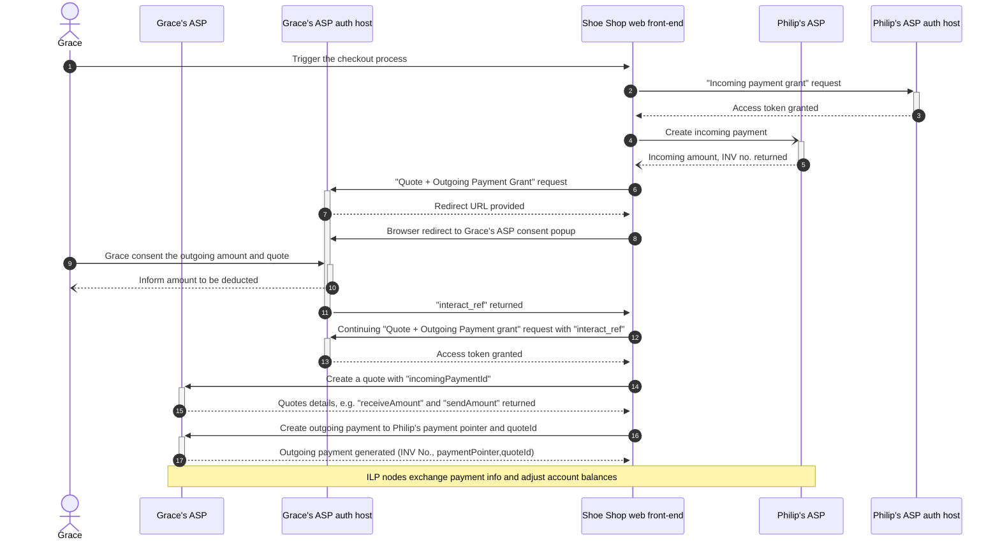

# Divao demo using Rafiki stack

## Pre-requisite

1. Please follow [Rafiki local playground setup](https://github.com/interledger/rafiki/blob/main/infrastructure/local/README.md) to install two ILP node, (a.k.a. account service provider), `backend` and `peer-backend`, in local environment.
2. Docker, pnpm, node 18 and NVM are required during installation.
3. Install Postman to access [Interledger](https://www.postman.com/interledger/workspace/interledger/collection/22855701-92761441-6d0c-4fc6-aa04-73eccf6afd4c?action=share&creator=1697784) public API collection, and fork it out to run locally.

## System check

You can use following links to see if the testing environment is running properly.

### Checking accounts on account service provider

[Backend account service provider](http://localhost:3030)

1. Grace Franklin https://backend/accounts/gfranklin 40.00 USD
2. Bert Hamchest https://backend/accounts/bhamchest 40.00 USD
3. World's Best Donut Co https://backend/accounts/wbdc 20.00 USD

[Peer backend account service provider](http://localhost:3031)

1. Philip Fry https://peer-backend/accounts/pfry 0.01 USD
2. PlanEx Corp https://peer-backend/accounts/planex 20.00 USD

## Demo details

### Scenario: Grace buy shoes from Shoe Shop, hence Philip "pull" money from Grace account to his account.



Use the [Postman eCommerce collection](https://www.postman.com/interledger/workspace/interledger/folder/22855701-e27838da-dd72-4b5e-9f1e-086ddfa4d098) to run through below steps.

1. Philip and Grace has accounts on separate **account service provider** (namely `peer-backend` and `backend`), with payment pointer linked to their accounts
2. Philip fires a **incoming payment grant request** (#2), to acquire access token necessary to carry out incoming payment
3. Philip fires a **incoming payement** (#4) (a.k.a. generate invoice), to specify the expectation of 33.64USD will come in.
4. Grace fires a **quote and outgoing payment grant request** (#6) to her `backend` ASP.
   - On the response, the `redirect` URL in the payload will instruct front-end to redirect Grace to outgoing payment consent page of `backend`.
   - Grace consents and generate `interactive_ref`, triggers **continuation request** (#12) to fire using the `interactive_ref` is used as payload, and the access token is generated
5. Grace **create a quote** (#14) by the access token acquired
6. Grace create **outgoing payment** (#16) by `quoteId` acquired BEFORE token expire (5, min)

Now, Grace's account is deducted to Philip's account, as shown in [backend](http://localhost:3030) and [peer-backend](http://localhost:3031)

## Problems

- API Payload Schema changed but no documentation. E.g.
  - To create payment pointer use API, no where to find `assetId` value, that need to be achieve by guesstimation.
- Some operation is time limited but not mentioned
- Several set of samples in Interledger Postman Collection, but only one set is working

### Query to account service providers

- [Graphql query](http://localhost:3001/graphql) to Primary account service provider, `backend`
- [Graphql query](http://localhost:4001/graphql) to Peer account service provider, `peer-backend`

e.g Create a new payment pointer using Graphql query

```
mutation CreatePaymentPointer($input: CreatePaymentPointerInput!) {
  createPaymentPointer(input: $input) {
    paymentPointer {
      url
      publicName
      asset {
        code
        scale
      }
    }
  }
}
```

Variables

```
{
  "input": {
    "url": "https://localhost:3000/accounts/smith",
    "publicName":"Mr Smith",
    "assetId": "c835f8a0-dd65-49eb-b40d-b8ced7e570bc"
  }
}
```

Expected response:

```
{
  "data": {
    "createPaymentPointer": {
      "paymentPointer": {
        "url": "https://localhost:3000/accounts/smith",
        "publicName": "Mr Smith",
        "asset": {
          "code": "USD",
          "scale": 2
        }
      }
    }
  }
}
```
